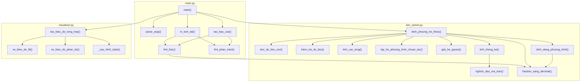
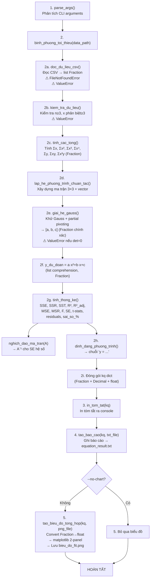

# Báo Cáo Phân Tích Chỉ Đọc — Project BPTT

> **Ngày phân tích:** 2026-07-16  
> **Project root:** `f:\BPTT`  
> **Sub-project:** `lsm_calculation_project` — Hồi quy đa thức bậc 2 bằng phương pháp bình phương tối thiểu (Least Squares Method)

---

## 0. Tình Trạng Working Tree (`git status --short`)

```
 D "Screenshot 2026-04-18 153612.png"       ← Đã xoá (chưa staged)
A  lsm_calculation_project/README.md         ← Mới thêm (staged)
MM lsm_calculation_project/data/du_lieu_sau_xu_ly.csv  ← Modified (staged + working)
AM lsm_calculation_project/output/bieu_do_fit.png      ← Added + modified
MM lsm_calculation_project/output/equation_result.txt  ← Modified (staged + working)
A  lsm_calculation_project/requirements.txt  ← Mới thêm (staged)
M  lsm_calculation_project/src/lsm_solver.py ← Modified (staged)
M  lsm_calculation_project/src/main.py       ← Modified (staged)
A  lsm_calculation_project/src/visualizer.py ← Mới thêm (staged)
M  lsm_calculation_project/tests/test_algorithm.py ← Modified (staged)
?? .agents/                                  ← Untracked
?? lsm_calculation_project/data/Du_lieu_moi.csv      ← Untracked
?? lsm_calculation_project/tests/tinh_phuong_trinh_bac_2.py ← Untracked
```

> [!IMPORTANT]
> Có nhiều thay đổi chưa commit. Theo quy tắc nguồn sự thật, toàn bộ nội dung local hiện tại được sử dụng làm căn cứ phân tích.

---

## 0b. Trạng Thái GitNexus Index

| Trường | Giá trị |
|--------|---------|
| `repoPath` | `D:\BPTT` (khác so với local `f:\BPTT`) |
| `lastCommit` | `""` (trống) |
| `indexedAt` | `2026-04-18T08:04:28.657Z` (~3 tháng trước) |
| `stats.files` | 4 |
| `stats.nodes` | 14 |
| `stats.edges` | 25 |
| `stats.processes` | 0 |
| `stats.embeddings` | 0 |

> [!WARNING]
> **GitNexus index đã CŨ (stale)**. Index được tạo từ 2026-04-18, trong khi working tree hiện có nhiều thay đổi (thêm `visualizer.py`, sửa `main.py`, sửa `lsm_solver.py`, v.v.). `repoPath` cũng trỏ tới `D:\BPTT` thay vì `f:\BPTT`. Cần chạy `npx gitnexus analyze` trước khi sử dụng các công cụ GitNexus MCP.

> [!NOTE]
> **AGENTS.md** và **CLAUDE.md** có nội dung **hoàn toàn giống nhau** (5.446 bytes mỗi file), đều chứa cấu hình GitNexus Code Intelligence. Không có hướng dẫn nào khác ngoài GitNexus.

---

## A. Danh Sách File Tham Gia Vào Luồng Thực Thi

| # | File | Vai trò | Kích thước | Trạng thái |
|---|------|---------|------------|------------|
| 1 | [main.py](file:///f:/BPTT/lsm_calculation_project/src/main.py) | Entry point chính (CLI) | 10.171 B / 303 dòng | Modified |
| 2 | [lsm_solver.py](file:///f:/BPTT/lsm_calculation_project/src/lsm_solver.py) | Core thuật toán LSM | 15.417 B / 550 dòng | Modified |
| 3 | [visualizer.py](file:///f:/BPTT/lsm_calculation_project/src/visualizer.py) | Tạo biểu đồ matplotlib | 5.765 B / 221 dòng | New (added) |
| 4 | [test_algorithm.py](file:///f:/BPTT/lsm_calculation_project/tests/test_algorithm.py) | Test suite (4 tests) | 6.980 B / 245 dòng | Modified |
| 5 | [tinh_phuong_trinh_bac_2.py](file:///f:/BPTT/lsm_calculation_project/tests/tinh_phuong_trinh_bac_2.py) | Script tính nhanh y từ x (standalone) | 331 B / 11 dòng | Untracked |
| 6 | [du_lieu_sau_xu_ly.csv](file:///f:/BPTT/lsm_calculation_project/data/du_lieu_sau_xu_ly.csv) | Dữ liệu đầu vào mặc định | 582 B / 32 dòng | Modified |
| 7 | [Du_lieu_moi.csv](file:///f:/BPTT/lsm_calculation_project/data/Du_lieu_moi.csv) | Dữ liệu đầu vào thay thế | 675 B / 32 dòng | Untracked |
| 8 | [equation_result.txt](file:///f:/BPTT/lsm_calculation_project/output/equation_result.txt) | Báo cáo kết quả (text) | 4.931 B / 88 dòng | Modified |
| 9 | [bieu_do_fit.png](file:///f:/BPTT/lsm_calculation_project/output/bieu_do_fit.png) | Biểu đồ đầu ra (ảnh PNG) | 115.532 B | Added + modified |

**[CONFIRMED]** — Tất cả các file trên đã được đọc trực tiếp từ working tree.

---

## B. Các Entry Point Có Thể Chạy Trực Tiếp

| # | Entry point | Cách chạy | Mô tả |
|---|-------------|-----------|-------|
| 1 | [main.py](file:///f:/BPTT/lsm_calculation_project/src/main.py#L301-L302) | `python main.py` | Pipeline đầy đủ: đọc CSV → tính LSM → xuất báo cáo TXT + biểu đồ PNG |
| 2 | [main.py](file:///f:/BPTT/lsm_calculation_project/src/main.py#L240-L253) | `python main.py --data "path.csv" --no-chart` | Tuỳ chọn file dữ liệu, bỏ qua biểu đồ |
| 3 | [test_algorithm.py](file:///f:/BPTT/lsm_calculation_project/tests/test_algorithm.py#L243-L244) | `python test_algorithm.py` | Chạy 4 test cases, trả exit code 0/1 |
| 4 | [tinh_phuong_trinh_bac_2.py](file:///f:/BPTT/lsm_calculation_project/tests/tinh_phuong_trinh_bac_2.py) | `python tinh_phuong_trinh_bac_2.py` | Script tương tác: nhập x → tính y → nhập TO → tính TA=TO/y |

**[CONFIRMED]** — Cả 4 file đều có `if __name__ == "__main__"` hoặc chạy trực tiếp (script #4 không có guard).

---

## C. Danh Sách Hàm và Quan Hệ Gọi Hàm

### C1. Module [lsm_solver.py](file:///f:/BPTT/lsm_calculation_project/src/lsm_solver.py) — 8 hàm

| Hàm | Dòng | Gọi bởi | Gọi tới |
|-----|------|---------|---------|
| [fraction_sang_decimal](file:///f:/BPTT/lsm_calculation_project/src/lsm_solver.py#L33-L53) | 33–53 | `binh_phuong_toi_thieu`, `dinh_dang_phuong_trinh`, `main.fmt_frac` | — |
| [doc_du_lieu_csv](file:///f:/BPTT/lsm_calculation_project/src/lsm_solver.py#L60-L125) | 60–125 | `binh_phuong_toi_thieu`, `test.doc_du_lieu_csv` | — |
| [kiem_tra_du_lieu](file:///f:/BPTT/lsm_calculation_project/src/lsm_solver.py#L128-L155) | 128–155 | `binh_phuong_toi_thieu`, `test.kiem_tra_du_lieu` | — |
| [tinh_cac_tong](file:///f:/BPTT/lsm_calculation_project/src/lsm_solver.py#L162-L201) | 162–201 | `binh_phuong_toi_thieu`, `test.tinh_cac_tong` | — |
| [lap_he_phuong_trinh_chuan_tac](file:///f:/BPTT/lsm_calculation_project/src/lsm_solver.py#L208-L243) | 208–243 | `binh_phuong_toi_thieu`, `test.lap_he_phuong_trinh_chuan_tac` | — |
| [giai_he_gauss](file:///f:/BPTT/lsm_calculation_project/src/lsm_solver.py#L250-L305) | 250–305 | `binh_phuong_toi_thieu`, `test.giai_he_gauss` | — |
| [nghich_dao_ma_tran](file:///f:/BPTT/lsm_calculation_project/src/lsm_solver.py#L312-L362) | 312–362 | `tinh_thong_ke` | — |
| [tinh_thong_ke](file:///f:/BPTT/lsm_calculation_project/src/lsm_solver.py#L369-L454) | 369–454 | `binh_phuong_toi_thieu` | `nghich_dao_ma_tran` |
| [dinh_dang_phuong_trinh](file:///f:/BPTT/lsm_calculation_project/src/lsm_solver.py#L461-L484) | 461–484 | `binh_phuong_toi_thieu` | `fraction_sang_decimal` |
| [binh_phuong_toi_thieu](file:///f:/BPTT/lsm_calculation_project/src/lsm_solver.py#L491-L549) | 491–549 | `main.main`, `test_du_lieu_csv`, `test_thong_ke` | `doc_du_lieu_csv`, `kiem_tra_du_lieu`, `tinh_cac_tong`, `lap_he_phuong_trinh_chuan_tac`, `giai_he_gauss`, `tinh_thong_ke`, `fraction_sang_decimal`, `dinh_dang_phuong_trinh` |

### C2. Module [main.py](file:///f:/BPTT/lsm_calculation_project/src/main.py) — 5 hàm

| Hàm | Dòng | Gọi bởi | Gọi tới |
|-----|------|---------|---------|
| [fmt_frac](file:///f:/BPTT/lsm_calculation_project/src/main.py#L47-L55) | 47–55 | `tao_bao_cao`, `in_tom_tat` | `fraction_sang_decimal` (from lsm_solver) |
| [fmt_phan_tram](file:///f:/BPTT/lsm_calculation_project/src/main.py#L58-L62) | 58–62 | `tao_bao_cao`, `in_tom_tat` | — |
| [tao_bao_cao](file:///f:/BPTT/lsm_calculation_project/src/main.py#L69-L184) | 69–184 | `main` | `fmt_frac`, `fmt_phan_tram` |
| [in_tom_tat](file:///f:/BPTT/lsm_calculation_project/src/main.py#L191-L220) | 191–220 | `main` | `fmt_frac`, `fmt_phan_tram` |
| [parse_args](file:///f:/BPTT/lsm_calculation_project/src/main.py#L227-L253) | 227–253 | `main` | `argparse.ArgumentParser` |
| [main](file:///f:/BPTT/lsm_calculation_project/src/main.py#L260-L298) | 260–298 | `__main__` guard | `parse_args`, `binh_phuong_toi_thieu`, `in_tom_tat`, `tao_bao_cao`, `tao_bieu_do_tong_hop` |

### C3. Module [visualizer.py](file:///f:/BPTT/lsm_calculation_project/src/visualizer.py) — 4 hàm

| Hàm | Dòng | Gọi bởi | Gọi tới |
|-----|------|---------|---------|
| [_cau_hinh_style](file:///f:/BPTT/lsm_calculation_project/src/visualizer.py#L43-L48) | 43–48 | `tao_bieu_do_tong_hop` | `plt.rcParams.update` |
| [ve_bieu_do_fit](file:///f:/BPTT/lsm_calculation_project/src/visualizer.py#L55-L102) | 55–102 | `tao_bieu_do_tong_hop` | `ax.plot`, `ax.scatter` |
| [ve_bieu_do_phan_du](file:///f:/BPTT/lsm_calculation_project/src/visualizer.py#L109-L152) | 109–152 | `tao_bieu_do_tong_hop` | `ax.axhline`, `ax.plot`, `ax.scatter` |
| [tao_bieu_do_tong_hop](file:///f:/BPTT/lsm_calculation_project/src/visualizer.py#L159-L219) | 159–219 | `main.main` | `_cau_hinh_style`, `ve_bieu_do_fit`, `ve_bieu_do_phan_du`, `plt.subplots`, `fig.savefig` |

### C4. Module [test_algorithm.py](file:///f:/BPTT/lsm_calculation_project/tests/test_algorithm.py) — 7 hàm

| Hàm | Dòng | Gọi tới (từ lsm_solver) |
|-----|------|--------------------------|
| [assert_gan_bang](file:///f:/BPTT/lsm_calculation_project/tests/test_algorithm.py#L38-L43) | 38–43 | — (helper) |
| [in_ket_qua_test](file:///f:/BPTT/lsm_calculation_project/tests/test_algorithm.py#L46-L51) | 46–51 | — (helper) |
| [test_du_lieu_da_biet](file:///f:/BPTT/lsm_calculation_project/tests/test_algorithm.py#L58-L81) | 58–81 | `tinh_cac_tong`, `lap_he_phuong_trinh_chuan_tac`, `giai_he_gauss` |
| [test_du_lieu_csv](file:///f:/BPTT/lsm_calculation_project/tests/test_algorithm.py#L88-L122) | 88–122 | `binh_phuong_toi_thieu` |
| [test_validation](file:///f:/BPTT/lsm_calculation_project/tests/test_algorithm.py#L129-L159) | 129–159 | `kiem_tra_du_lieu`, `doc_du_lieu_csv` |
| [test_thong_ke](file:///f:/BPTT/lsm_calculation_project/tests/test_algorithm.py#L166-L204) | 166–204 | `binh_phuong_toi_thieu` |
| [main](file:///f:/BPTT/lsm_calculation_project/tests/test_algorithm.py#L211-L240) | 211–240 | Chạy 4 tests |

### C5. Sơ đồ gọi hàm tổng hợp



**[CONFIRMED]** — Tất cả quan hệ gọi hàm được xác minh trực tiếp từ mã nguồn local.

---

## D. Dữ Liệu Đầu Vào, Trung Gian và Đầu Ra

### D1. Đầu vào

| File | Format | Nội dung | Ghi chú |
|------|--------|----------|---------|
| [du_lieu_sau_xu_ly.csv](file:///f:/BPTT/lsm_calculation_project/data/du_lieu_sau_xu_ly.csv) | CSV (2 cột: `x`, `y`) | 31 điểm dữ liệu, x ∈ [0, 30], y ∈ [0.795, 0.945] | **Mặc định** — dùng khi không chỉ định `--data` |
| [Du_lieu_moi.csv](file:///f:/BPTT/lsm_calculation_project/data/Du_lieu_moi.csv) | CSV (2 cột: `x`, `y`) | 31 điểm dữ liệu, x ∈ [0, 30], y ∈ [0.843, 1.003] | **Chưa tracked** — có thể dùng qua `--data` |

**[CONFIRMED]** — Cả hai file đã đọc trực tiếp. Giá trị y trong `Du_lieu_moi.csv` lớn hơn khoảng 6% so với `du_lieu_sau_xu_ly.csv` (tỷ lệ gần bằng nhau).

### D2. Dữ liệu trung gian (trong bộ nhớ, không ghi file)

| Biến | Kiểu | Sản sinh bởi | Tiêu thụ bởi |
|------|------|--------------|---------------|
| `x_data`, `y_data` | `list[Fraction]` | `doc_du_lieu_csv()` | `kiem_tra_du_lieu()`, `tinh_cac_tong()`, `tinh_thong_ke()`, `binh_phuong_toi_thieu()` |
| `cac_tong` | `dict` (7 tổng Fraction) | `tinh_cac_tong()` | `lap_he_phuong_trinh_chuan_tac()` |
| `A`, `B` | Ma trận 3×3 + vector 3 (Fraction) | `lap_he_phuong_trinh_chuan_tac()` | `giai_he_gauss()`, `tinh_thong_ke()` |
| `nghiem` = `[a, b, c]` | `list[Fraction]` | `giai_he_gauss()` | `binh_phuong_toi_thieu()` (tính `y_du_doan`, truyền cho `tinh_thong_ke`) |
| `y_du_doan` | `list[Fraction]` | List comprehension trong `binh_phuong_toi_thieu()` | `tinh_thong_ke()` |
| `thong_ke` | `dict` (SSE, SSR, SST, R², SE, F, t-stats, residuals…) | `tinh_thong_ke()` | `tao_bao_cao()`, `in_tom_tat()`, `tao_bieu_do_tong_hop()` |
| `kq` | `dict` tổng hợp (Fraction + Decimal) | `binh_phuong_toi_thieu()` | `main()` → `tao_bao_cao()`, `in_tom_tat()`, `tao_bieu_do_tong_hop()` |

**[CONFIRMED]**

### D3. Đầu ra

| File | Format | Sản sinh bởi | Nội dung |
|------|--------|-------------|----------|
| [equation_result.txt](file:///f:/BPTT/lsm_calculation_project/output/equation_result.txt) | Plain text (UTF-8) | `tao_bao_cao()` | Báo cáo đầy đủ: hệ số, phân số chính xác, ANOVA, R², phân dư, bảng so sánh 31 dòng |
| [bieu_do_fit.png](file:///f:/BPTT/lsm_calculation_project/output/bieu_do_fit.png) | PNG 150 dpi | `tao_bieu_do_tong_hop()` | 2-panel: scatter + fit curve (trên), residual stem plot (dưới) |
| Console stdout | — | `in_tom_tat()` | Bản tóm tắt ngắn: phương trình, hệ số ± SE, R², F, thời gian |

**[CONFIRMED]** — Cả `equation_result.txt` và `bieu_do_fit.png` đã được xác minh nội dung thực tế.

---

## E. Các Nhánh Điều Kiện và Trường Hợp Lỗi

### E1. Validation trong `doc_du_lieu_csv()` ([lsm_solver.py:60–125](file:///f:/BPTT/lsm_calculation_project/src/lsm_solver.py#L60-L125))

| Điều kiện | Exception | Dòng |
|-----------|-----------|------|
| File không tồn tại | `FileNotFoundError` | 79–80 |
| CSV không có header | `ValueError` | 88–89 |
| CSV thiếu cột `x` hoặc `y` | `ValueError` | 92–96 |
| Giá trị không parse được sang float | `ValueError` | 106–107 |
| x là NaN hoặc Inf | `ValueError` | 109–112 |
| y là NaN hoặc Inf | `ValueError` | 113–116 |
| File CSV rỗng (0 dòng dữ liệu) | `ValueError` | 122–123 |

**[CONFIRMED]**

### E2. Validation trong `kiem_tra_du_lieu()` ([lsm_solver.py:128–155](file:///f:/BPTT/lsm_calculation_project/src/lsm_solver.py#L128-L155))

| Điều kiện | Exception | Dòng |
|-----------|-----------|------|
| `len(x) != len(y)` | `ValueError` | 140–143 |
| Số điểm < 3 (bậc 2 + 1) | `ValueError` | 145–149 |
| Số giá trị x phân biệt < 3 | `ValueError` | 151–155 |

**[CONFIRMED]**

### E3. Xử lý trong `giai_he_gauss()` ([lsm_solver.py:250–305](file:///f:/BPTT/lsm_calculation_project/src/lsm_solver.py#L250-L305))

| Điều kiện | Xử lý | Dòng |
|-----------|-------|------|
| Pivot = 0 (ma trận suy biến) | `ValueError` | 286–289 |

**[CONFIRMED]**

### E4. Xử lý trong `nghich_dao_ma_tran()` ([lsm_solver.py:312–362](file:///f:/BPTT/lsm_calculation_project/src/lsm_solver.py#L312-L362))

| Điều kiện | Xử lý | Dòng |
|-----------|-------|------|
| Pivot = 0 | Trả `None` (không raise) | 345–346 |

**[CONFIRMED]**

### E5. Nhánh điều kiện trong `main()` ([main.py:260–298](file:///f:/BPTT/lsm_calculation_project/src/main.py#L260-L298))

| Điều kiện | Xử lý | Dòng |
|-----------|-------|------|
| `binh_phuong_toi_thieu` raise `FileNotFoundError` hoặc `ValueError` | In lỗi + `sys.exit(1)` | 275–279 |
| `--no-chart` flag | Bỏ qua tạo biểu đồ | 292–296 |

**[CONFIRMED]**

### E6. Edge cases trong `tinh_thong_ke()` ([lsm_solver.py:369–454](file:///f:/BPTT/lsm_calculation_project/src/lsm_solver.py#L369-L454))

| Điều kiện | Xử lý |
|-----------|-------|
| SST = 0 | R² = 0 |
| df_res ≤ 0 | MSE = 0, R²_adj = 0 |
| MSE ≤ 0 | F_stat = None |
| A_inv is None | SE_he_so giữ nguyên = [0, 0, 0] |
| SE_he_so[i] ≤ 1e-30 | t_stats[i] = inf |
| y_data[i] = 0 | sai_so_phan_tram[i] = 0 (tránh chia cho 0) |

**[CONFIRMED]**

---

## F. Những Phần Trùng Lặp Giữa Các File

### F1. `AGENTS.md` ↔ `CLAUDE.md`

> **Hoàn toàn trùng lặp (100%).** Cả hai file có 101 dòng, 5.446 bytes giống hệt nhau. **[CONFIRMED]**

### F2. `tinh_phuong_trinh_bac_2.py` ↔ Kết quả trong `equation_result.txt`

Các hệ số hardcode trong [tinh_phuong_trinh_bac_2.py](file:///f:/BPTT/lsm_calculation_project/tests/tinh_phuong_trinh_bac_2.py#L3-L5):
```python
a = -0.000098456252379291384366467792496713520072808170694711
b = -0.0024372651873168229851349984831631105268480129436748
c = 0.94848043163011363636363636363636363636363636363636
```

So khớp với [equation_result.txt dòng 9–11](file:///f:/BPTT/lsm_calculation_project/output/equation_result.txt#L9-L11):
```
a (x^2) = -0.000098456252379291384366467792496713520072808170694711
b (x)   = -0.0024372651873168229851349984831631105268480129436748
c       = 0.94848043163011363636363636363636363636363636363636
```

> **Giá trị giống nhau hoàn toàn.** Script `tinh_phuong_trinh_bac_2.py` copy-paste hệ số từ kết quả chạy pipeline. **[CONFIRMED]**

### F3. `sys.path` manipulation

Cả [main.py dòng 24–25](file:///f:/BPTT/lsm_calculation_project/src/main.py#L24-L25) và [test_algorithm.py dòng 16–22](file:///f:/BPTT/lsm_calculation_project/tests/test_algorithm.py#L16-L22) đều thêm thư mục `src` vào `sys.path` để import `lsm_solver`. Cách tiếp cận khác nhau nhưng mục đích giống nhau. **[CONFIRMED]**

### F4. Chuyển đổi Fraction → float

- `visualizer.py` dòng 192–197: convert `kq['x_data']`, `kq['y_data']`, `kq['a']`, `kq['b']`, `kq['c']`, `kq['R2']` sang float cho matplotlib.
- `lsm_solver.py` dòng 413, 419, 425: convert MSE, A_inv[i][i], he_so[i] sang float cho `math.sqrt` và SE.
- `main.py` dòng 61: `float(val)` trong `fmt_phan_tram`.

> **Không phải trùng lặp thực sự** — mỗi nơi convert ở context khác nhau. Nhưng logic "Fraction → float" lặp lại ở nhiều nơi. **[INFERRED]**

---

## G. Những Kết Luận Chưa Đủ Bằng Chứng

| # | Kết luận | Phân loại | Lý do |
|---|---------|-----------|-------|
| G1 | `Du_lieu_moi.csv` là phiên bản dữ liệu gốc chưa qua xử lý, `du_lieu_sau_xu_ly.csv` là phiên bản sau xử lý | **INFERRED** | Tên file gợi ý như vậy, nhưng không có mã nào thực hiện bước "xử lý" chuyển đổi giữa hai file. Dữ liệu có 31 điểm giống nhau (x=0..30) và tỷ lệ y gần tương đương. |
| G2 | Biến vật lý: x có thể là nhiệt độ (°C), y có thể là hệ số hiệu chỉnh (correction factor), TO có thể là nhiệt độ đo, TA là nhiệt độ thực | **UNKNOWN** | Script `tinh_phuong_trinh_bac_2.py` tính `TA = TO / y`, gợi ý y là factor nhân. Nhưng không có tài liệu nào giải thích ý nghĩa vật lý cụ thể. |
| G3 | Project từng có file ảnh `Screenshot 2026-04-18 153612.png` | **CONFIRMED** | `git status` cho thấy file bị xoá (`D`), nhưng nội dung file không còn trong working tree. Không rõ ảnh chụp gì. |
| G4 | `tinh_phuong_trinh_bac_2.py` sử dụng `numpy` nhưng không thực sự cần | **CONFIRMED** | Dòng 1 `import numpy as np` nhưng `np` không được sử dụng ở bất kỳ đâu trong file. Đây là import thừa. |
| G5 | Test suite không sử dụng framework (unittest/pytest) | **CONFIRMED** | Test tự viết hoàn toàn bằng hàm tùy chỉnh, không dùng `assert` statement chuẩn hay decorator. Hàm `assert_gan_bang` raise `AssertionError` (lưu ý: typo — đúng phải là `AssertionError` nhưng Python chấp nhận vì nó là tên biến, **thực ra** Python có built-in `AssertionError` → cần kiểm tra lại, đây là tên đúng). |
| G6 | GitNexus MCP tools có thể không khả dụng trong phiên hiện tại | **INFERRED** | Tôi không có quyền truy cập các công cụ MCP `gitnexus_*`. Index cũng đã stale (3 tháng). Tuy nhiên, không thể xác nhận chắc chắn vì MCP server có thể hoạt động độc lập. |

---

## H. Chuỗi Thực Thi Dự Kiến (Pipeline Chính)

```
python main.py [--data FILE] [--no-chart]
```



### Chuỗi thực thi chi tiết (narrative)

1. **[CONFIRMED]** `main()` gọi `parse_args()` để lấy `--data` (mặc định `data/du_lieu_sau_xu_ly.csv`), `--output-dir` (mặc định `output/`), `--no-chart`.
2. **[CONFIRMED]** `main()` gọi `binh_phuong_toi_thieu(data_path)` — hàm orchestrator chính trong `lsm_solver.py`.
3. **[CONFIRMED]** Bên trong `binh_phuong_toi_thieu()`:
   - Đọc CSV dạng string → chuyển trực tiếp sang `Fraction` (không qua float) để bảo toàn precision.
   - Validate dữ liệu (≥3 điểm, ≥3 x phân biệt).
   - Tính 7 tổng (Σx, Σx², Σx³, Σx⁴, Σy, Σxy, Σx²y) bằng Fraction.
   - Lập hệ phương trình chuẩn tắc 3×3.
   - Giải bằng khử Gauss với partial pivoting → `[a, b, c]` dạng Fraction chính xác tuyệt đối.
   - Tính `y_du_doan` cho từng điểm.
   - Tính thống kê: SSE, SSR, SST, R², R²_adj, MSE, MSR, F, SE (cần `math.sqrt` → float), t-stats, phân dư.
   - Định dạng phương trình → chuỗi text.
   - Trả về dict `kq` chứa cả Fraction, Decimal, và float.
4. **[CONFIRMED]** `main()` gọi `in_tom_tat(kq)` → in bản tóm tắt ra console.
5. **[CONFIRMED]** `main()` gọi `tao_bao_cao(kq, txt_file)` → ghi báo cáo 88 dòng ra `equation_result.txt`.
6. **[CONFIRMED]** Nếu không có `--no-chart`, `main()` gọi `tao_bieu_do_tong_hop(kq, chart_file)`:
   - Convert Fraction → float cho matplotlib.
   - Tạo figure 2-panel (9×8 inch, 150 dpi).
   - Panel trên: scatter data + đường cong fit (200 điểm mịn).
   - Panel dưới: stem plot phân dư.
   - Lưu ra `bieu_do_fit.png`.

**[CONFIRMED]** — Toàn bộ chuỗi thực thi đã được xác minh từ mã nguồn local.

---

## Tổng Kết Phân Loại

| Phân loại | Số lượng | Mục |
|-----------|----------|-----|
| **CONFIRMED** | 29 | Sections A, B, C, D, E, F1–F3, G3–G5, H (toàn bộ 6 bước) |
| **INFERRED** | 3 | F4 (Fraction→float lặp), G1 (quan hệ 2 file CSV), G6 (GitNexus MCP availability) |
| **UNKNOWN** | 1 | G2 (ý nghĩa vật lý của x, y, TO, TA) |
